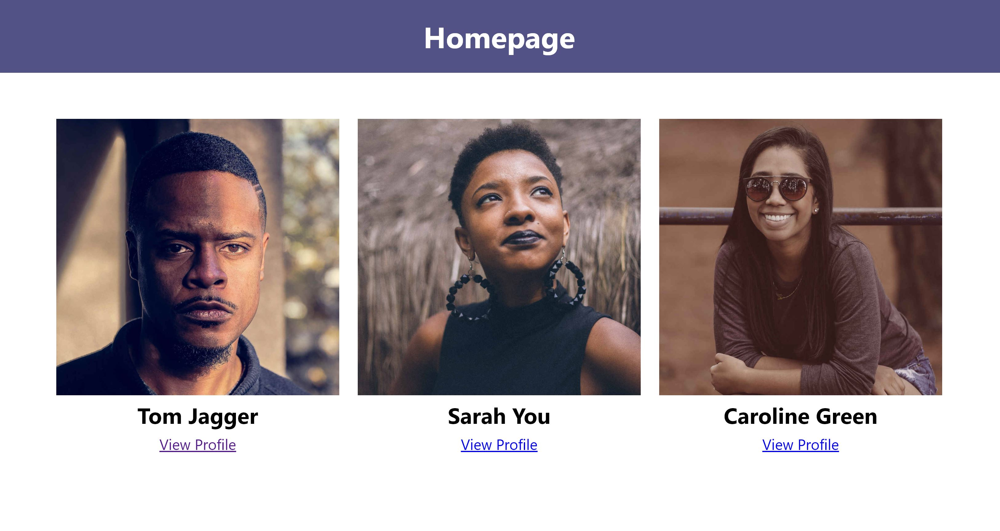

# Profiles

- Create a website with two views: **index** and **profile**
- The index view should display a list of all people in the json-Data. Each entry should be linked to a profile page
- The profile page should display the info of the person

